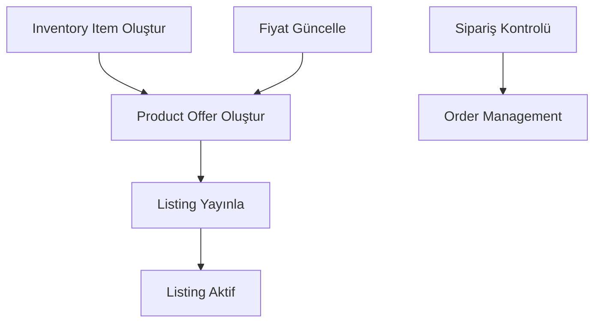

# eBay NestJS Integration API

Bu proje, eBay marketplace entegrasyonu için geliştirilmiş kapsamlı bir NestJS API'sidir. eBay API v9.2.0 kütüphanesini kullanarak ürün yönetimi ve sipariş işlemlerini gerçekleştirir.

## 🚀 Özellikler

- ✅ **Inventory Management**: Inventory item oluşturma ve yönetimi
- ✅ **Product Offers**: Ürün offer'ları oluşturma ve güncelleme
- ✅ **Listing Management**: Listing yayınlama ve durum kontrolü
- ✅ **Price Management**: Dinamik fiyat güncelleme
- ✅ **Order Management**: Sipariş listeleme ve detay görüntüleme
- ✅ **OAuth2 Authentication**: Otomatik token yenileme
- ✅ **Swagger Documentation**: Interaktif API dokümantasyonu
- ✅ **Input Validation**: Kapsamlı veri doğrulama
- ✅ **Error Handling**: Gelişmiş hata yönetimi
- ✅ **Logging**: Detaylı işlem logları

## 📋 Gereksinimler

- Node.js 16+
- npm veya yarn
- eBay Developer Account
- eBay API Credentials

## 🛠️ Kurulum

### 1. Projeyi Klonlayın

```bash
git clone <repository-url>
cd ebay-nestjs-integration
```

### 2. Bağımlılıkları Yükleyin

```bash
npm install
# veya
yarn install
```

### 3. Environment Variables

`.env` dosyası oluşturun:

```bash
cp .env.example .env
```

`.env` dosyasını düzenleyin:

```env
# eBay API Configuration
EBAY_APP_ID=your_ebay_app_id_here
EBAY_CERT_ID=your_ebay_cert_id_here
EBAY_RU_NAME=your_ebay_ru_name_here
EBAY_AUTH_CODE=your_ebay_auth_code_here
EBAY_SANDBOX=true
EBAY_MERCHANT_LOCATION=your_merchant_location_key_here

# Application Configuration
PORT=3000
NODE_ENV=development

# eBay Marketplace Configuration
EBAY_MARKETPLACE_ID=EBAY_US
EBAY_CURRENCY=USD
EBAY_COUNTRY_CODE=US
```

### 4. Uygulamayı Başlatın

```bash
# Development mode
npm run start:dev

# Production mode
npm run build
npm run start:prod
```

## 📚 API Dokümantasyonu

### Swagger UI

Uygulama çalıştıktan sonra aşağıdaki adreslere erişebilirsiniz:

- **API Base URL**: `http://localhost:3000/api`
- **Swagger Docs**: `http://localhost:3000/api/docs`

### Detaylı Dokümantasyon

Kapsamlı API dokümantasyonu için [`API_DOCUMENTATION.md`](./API_DOCUMENTATION.md) dosyasını inceleyin.

## 🔄 eBay API Workflow

### Ürün Ekleme Süreci:



1. **Inventory Item Oluştur**: `POST /api/ebay/inventory`
2. **Product Offer Oluştur**: `POST /api/ebay/products`
3. **Listing Yayınla**: `POST /api/ebay/products/{offerId}/publish`

## 🧪 Test Etme

### Test Verileri

[`test-examples/sample-data.json`](./test-examples/sample-data.json) dosyasında örnek test verileri bulabilirsiniz.

### Swagger ile Test

1. `http://localhost:3000/api/docs` adresine gidin
2. Endpoint'leri test edin
3. Örnek request/response'ları görün

### Örnek Test Senaryosu

```bash
# 1. Inventory item oluştur
curl -X POST http://localhost:3000/api/ebay/inventory \
  -H "Content-Type: application/json" \
  -d '{
    "sku": "TEST-001",
    "title": "Test Product",
    "description": "Test description",
    "brand": "TestBrand",
    "condition": "NEW",
    "quantity": 10
  }'

# 2. Product offer oluştur
curl -X POST http://localhost:3000/api/ebay/products \
  -H "Content-Type: application/json" \
  -d '{
    "sku": "TEST-001",
    "title": "Test Product",
    "description": "Test description",
    "price": 99.99,
    "quantity": 10,
    "brand": "TestBrand",
    "condition": "NEW",
    "categoryId": "9355"
  }'

# 3. Listing yayınla
curl -X POST http://localhost:3000/api/ebay/products/{offerId}/publish \
  -H "Content-Type: application/json" \
  -d '{"duration": 7}'
```

## 📁 Proje Yapısı

```
src/
├── ebay/
│   ├── ebay.controller.ts    # API endpoints
│   ├── ebay.service.ts       # Business logic
│   └── ebay.dto.ts          # Data transfer objects
├── app.module.ts            # Ana modül
└── main.ts                  # Uygulama başlangıcı

test-examples/
└── sample-data.json         # Test verileri

.env.example                 # Environment variables örneği
API_DOCUMENTATION.md         # Detaylı API dokümantasyonu
```

## 🔧 Geliştirme

### Kod Formatı

```bash
# Kodu formatla
npm run format

# Lint kontrolü
npm run lint
```

### Test

```bash
# Unit testler
npm run test

# E2E testler
npm run test:e2e

# Test coverage
npm run test:cov
```

## 📊 API Endpoints

| Method | Endpoint                               | Açıklama               |
| ------ | -------------------------------------- | ---------------------- |
| POST   | `/api/ebay/inventory`                  | Inventory item oluştur |
| POST   | `/api/ebay/products`                   | Product offer oluştur  |
| POST   | `/api/ebay/products/{offerId}/publish` | Listing yayınla        |
| PATCH  | `/api/ebay/products/{offerId}/price`   | Fiyat güncelle         |
| GET    | `/api/ebay/products/{offerId}/status`  | Listing durumu         |
| GET    | `/api/ebay/orders`                     | Siparişleri listele    |
| GET    | `/api/ebay/orders/{orderId}`           | Sipariş detayı         |

## 🔐 Güvenlik

- OAuth2 token authentication
- Input validation ve sanitization
- CORS desteği
- Environment variables ile credential yönetimi
- Rate limiting (eBay API limitlerine uygun)

## 🐛 Troubleshooting

### Yaygın Hatalar

1. **Authentication Error**

   ```
   Failed to authenticate with eBay: Invalid credentials
   ```

   **Çözüm**: eBay credentials'larını kontrol edin

2. **Invalid Category ID**

   ```
   Failed to create product: Invalid category ID
   ```

   **Çözüm**: Doğru eBay category ID kullanın

3. **Inventory Item Not Found**
   ```
   Failed to create offer: Inventory item not found
   ```
   **Çözüm**: Önce inventory item oluşturun

### Debug

```bash
# Debug mode ile çalıştır
npm run start:debug

# Logları kontrol et
tail -f logs/application.log
```

## 🤝 Katkıda Bulunma

1. Fork yapın
2. Feature branch oluşturun (`git checkout -b feature/amazing-feature`)
3. Commit yapın (`git commit -m 'Add amazing feature'`)
4. Push yapın (`git push origin feature/amazing-feature`)
5. Pull Request oluşturun

## 📄 Lisans

Bu proje MIT lisansı altında lisanslanmıştır.

## 📞 Destek

Herhangi bir sorun yaşarsanız:

1. [Issues](../../issues) sayfasından yeni bir issue oluşturun
2. [`API_DOCUMENTATION.md`](./API_DOCUMENTATION.md) dosyasını inceleyin
3. eBay Developer Console'u kontrol edin

## 🔄 Versiyon Geçmişi

- **v1.0.0** (2024-01-01)
  - İlk sürüm
  - Temel eBay entegrasyonu
  - CRUD operasyonları
  - Swagger dokümantasyonu
  - OAuth2 authentication
  - Comprehensive error handling

---

**Not**: Bu proje sadece eBay API v9.2.0 kütüphanesini kullanır ve eBay'in resmi geliştirici dokümantasyonuna uygun olarak geliştirilmiştir.
